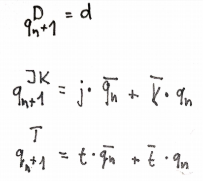

# # Lab. work 07 - Latches and Flip-flops
# Preparation tasks

| **clk** | **d** | **q(n)** | **q(n+1)** | **Comments** |
   | :-: | :-: | :-: | :-: | :-- |
   |  | 0 | 0 | 0 | Sampled and stored |
   |  | 0 | 1 | 0 | Sampled and stored |
   |  | 1 | 0 | 1 | Sampled and stored |
   |  | 1 | 1 | 1 | Sampled and stored |

   | **clk** | **j** | **k** | **q(n)** | **q(n+1)** | **Comments** |
   | :-: | :-: | :-: | :-: | :-: | :-- |
   |  | 0 | 0 | 0 | 0 | No change |
   |  | 0 | 0 | 1 | 1 | No change |
   |  | 0 | 1 | 0 | 0 | Reset |
   |  | 0 | 1 | 1 | 0 | Reset |
   |  | 1 | 0 | 0 | 1 | Set |
   |  | 1 | 0 | 1 | 1 | Set |
   |  | 1 | 1 | 0 | 1 | Toggle (=invert) |
   |  | 1 | 1 | 1 | 0 | Toggle (=invert) |

   | **clk** | **t** | **q(n)** | **q(n+1)** | **Comments** |
   | :-: | :-: | :-: | :-: | :-- |
   |  | 0 | 0 | 0 | No change |
   |  | 0 | 1 | 1 | No change |
   |  | 1 | 0 | 1 | Toggle (=invert) |
   |  | 1 | 1 | 0 | Toggle (=invert) |
